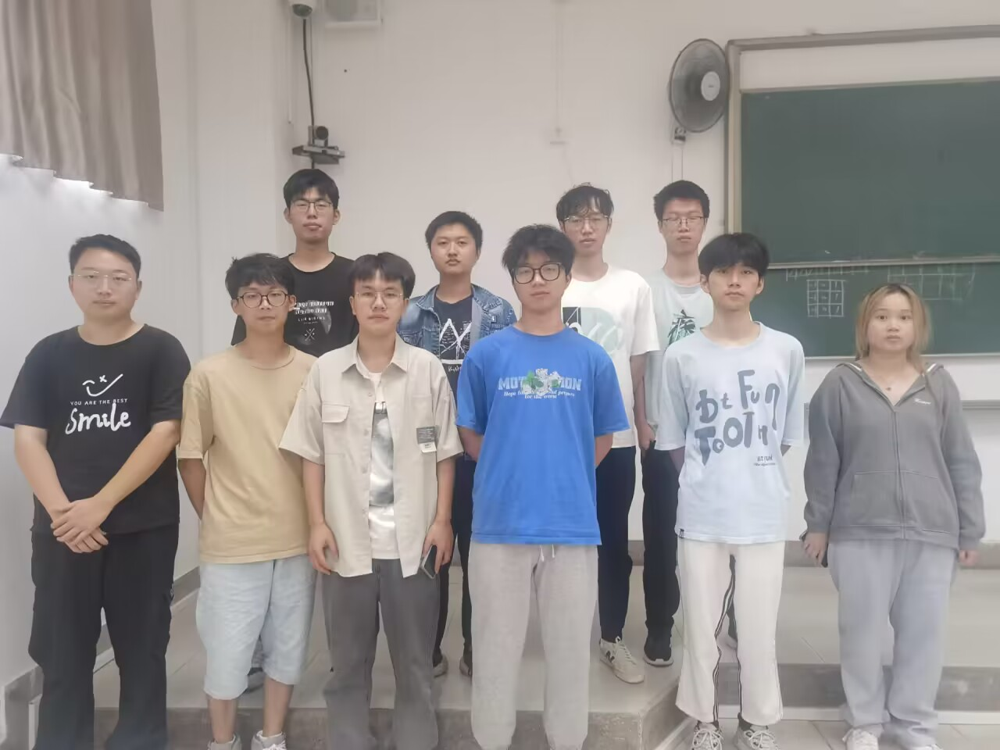

| 这个作业属于哪个课程 | <班级链接>       |
| :------------------- | :--------------- |
| 这个作业要求在哪里   | <作业要求的链接> |
| 团队名称             |                  |
| 这个作业的目标       | <写上具体方面>   |
| 其他参考文献         | ...              |

## 团队

### 团队成员自我介绍

#### 沈轻腾

学号102101624，男，计算机软件理论，福建人

#### 余超越

学号102101623，男，计算机应用方向学生，福建人。

#### 黄鸿哲

学号102101641，男，计算机系统结构方向学生，福建人

#### 柯嘉荧

学号102101606，女，计算机系统结构方向学生，福建人。

#### 吴荣钦

学号102101621，男，计算机应用方向学生，福建人

#### 李涵

学号102101618，男，计算机应用方向，福建人

#### 林驰易

学号102101328，男，计算机应用方向，福建人

#### 王益鑫

学号102101313，男，计算机应用方向，江西人

#### 杨志成

学号102101620，男，计算机应用方向，贵州人

#### 张一凡

学号102101625，男，计算机网络工程方向，福建人

### 团队合影

### **项目整体计划安排**

1. 项目启动（1周）

- 项目定义和目标设定
- 团队组建：招募开发者、设计师和测试人员
- 需求分析和规划

该阶段确定大致的产品方向

1. 设计阶段（1周）

- 用户界面（UI）和用户体验（UX）设计
- 数据库设计和数据模型制定
- 技术架构和栈选择

该阶段确定ui,后端和数据库框架

1. 开发阶段（4周）

- 前端和后端开发
- 用户认证和权限管理
- 帖子和评论功能开发

该阶段结束后，发布一个有简单功能的demo

1. 测试和质量保证（1周）

- 功能测试
- 性能测试
- 安全性测试
- 用户体验测试

对基本的软件漏洞进行测试

1. 发布和部署（1周）

- 生产环境部署
- 应用程序性能监控

对基本的软件漏洞进行测试，并部署后端

1. 持续改进（持续）

- 收集用户反馈
- 更新应用程序

### 关键点，难点分析

1. 用户注册和认证：确保用户能够注册、登录和管理其个人资料是关键。使用安全的认证方法来保护用户数据。
2. 用户界面和用户体验：设计直观、吸引人的用户界面，以提供出色的用户体验。用户应该能够轻松浏览帖子、回复、发布内容和与其他用户互动。
3. 数据管理：有效管理用户、帖子、评论和其他相关数据。选择合适的数据库系统，进行数据库设计，以确保性能和可扩展性。
4. 权限管理：定义用户权限和角色，以确保用户只能访问其有权访问的内容和功能。这包括管理员、版主和普通用户的权限管理。
5. 安全性：保护用户数据和应用程序免受潜在的攻击，如跨站脚本（XSS）、跨站请求伪造（CSRF）和SQL注入等。
6. 搜索和过滤：提供高效的搜索和帖子过滤功能，以便用户能够轻松找到感兴趣的内容。

### 组员分工、组员工作量比例

| 学号      | 工作内容               | 贡献度 |
| --------- | ---------------------- | ------ |
| 102101641 | gin接口开发            | 10%    |
| 102101623 | mysql                  | 10%    |
| 102101624 | 移动端 android ios开发 | 10%    |
| 102101606 | web                    | 10%    |
| 102101328 | web                    | 10%    |
| 102101313 | web                    | 10%    |
| 102101618 | gin接口开发            | 10%    |
| 102101621 | redis                  | 10%    |
| 102101625 | redis                  | 10%    |
| 102101620 | msql                   | 10%    |

### 成员协作方式

通过git进行版本同步和修改，各自负责模块，再统一提交到github，进行审核，合并

### 需求规格说明书

https://github.com/Futalker/-software_requirements_specification/blob/Main/%E8%BD%AF%E4%BB%B6%E9%9C%80%E6%B1%82%E8%A7%84%E6%A0%BC%E8%AF%B4%E6%98%8E%E4%B9%A6.md

### 需求分析PPT

https://github.com/Futalker/-software_requirements_specification/blob/Main/%E9%9C%80%E6%B1%82%E5%88%86%E6%9E%90PPT.pdf

