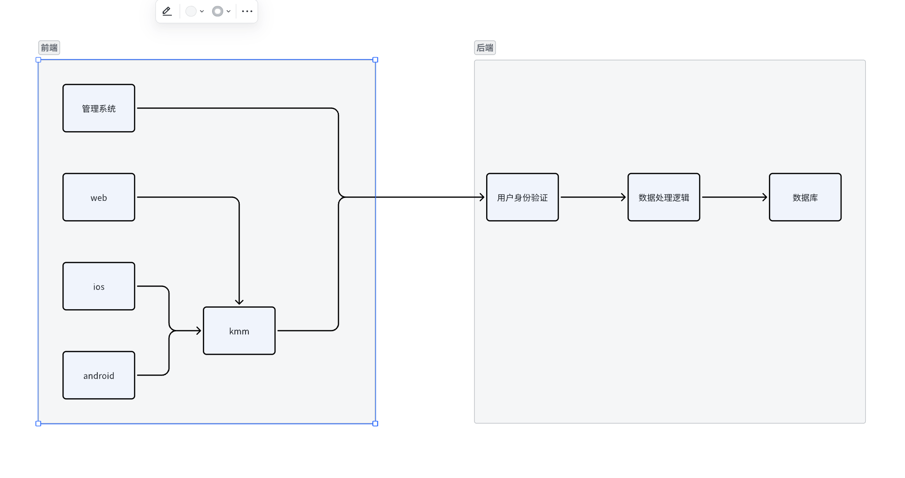

# 需求规则说明书

## 1.引言

### 1.1编写目的

论坛项目可以提供一个平台，让人们分享信息、讨论话题、提出问题和互相交流。这种项目的目的是促进社交互动和知识共享。开发一个论坛项目是一个极好的技术实践机会。开发者可以应用各种编程技能，包括前端开发、后端开发、数据库管理等，以构建一个全功能的网站。是一个非常好的实践机会

### 1.2项目背景

校园论坛的主要目的是促进校园内的信息共享、互相帮助和互动。学生和教职工可以在这里提出问题、分享课程建议、寻找失物。而在福州大学中目前缺失这种平台

### 1.3参考资料

https://www.jetbrains.com/lp/compose-multiplatform/

https://gin-gonic.com/docs/

## 2.总体描述

### 2.1 目标

#### 2.1.1开发意图

利用compose的跨平台技术 ，搭配后端构建一个跨android ，ios的论坛软件

#### 2.1.2应用目标和作用范围

该软件面向所有福州大学在读生，实现信息共享和资源共享

#### 2.1.3产品前景

目前福州大学缺少相关精品，却有相关需求，包括失物招领，选课查询等，前景较好

## 3.具体要求

### 3.1类图

### 3.2属性

#### 3.2.1可用性

界面基于新一代ui框架compose，跨平台技术让ios和android 可以体验几乎完全的软件体验，go后端的引入，提高了访问速度

#### 3.2.2安全性

代码混淆，避免逆向

数据库加密。避免入侵

## 4.功能描述及验收验证标准

### 4.1具体功能描述

用户可以发帖，查看帖，分享他们的消息，共享他们的资源

### 4.2输入输出格式

输入文字，输出文字

### 4.3界面验收标准

帖子列表页，帖子详情页，帖子发布页，个人主页

### 4.4功能验收标准

发帖，查看帖，查看个人主页，修改个人信息